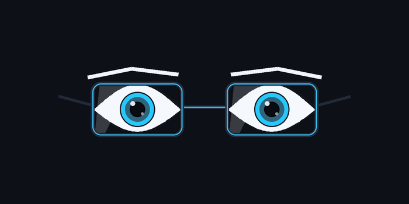

<!-- Banner Header -->

 

<!-- Typing SVG Quote -->

  

<!-- Animated Hero Illustration: Cyberpunk Glasses Slide & Evil Squint Eyes -->

  

<!-- Social & Profile Badges -->

 

### 👁️‍🗨️ About Me

  <table>
    <tr>
      <td width="50%" valign="top">
        <h4>⚡ Profile Overview</h4>
        <ul>
          <li>👤 <b>Username:</b> <code>gustidash-cell</code></li>
          <li>👨‍💻 <b>Name:</b> Gustavo / Gusti</li>
          <li>📍 <b>Location:</b> Indonesia</li>
          <li>🎯 <b>Core Mindset:</b> <i>"Real Eyes Realize Real Lies"</i></li>
        </ul>
      </td>
      <td width="50%" valign="top">
        <h4>🚀 Primary Focus</h4>
        <ul>
          <li>💻 <b>Web & System Development:</b> Building modern web applications & APIs.</li>
          <li>📚 <b>Educational Tools:</b> Interactive learning modules for Mathematics & Science.</li>
          <li>🧠 <b>Algorithm & Analytics:</b> Data structure, proof tools, & computational logic.</li>
        </ul>
      </td>
    </tr>
  </table>

- 🔭 **Current Work:** Developing interactive software applications and mathematical proof learning systems.
- 💡 **Interests:** Web Technologies, Applied Mathematics, Computational Logic & System Architecture.
- ⚡ **Fun Fact:** Driven by curiosity, continuous research, and clean, high-performance code.

---

### 🛠️ Tech Stack & Ecosystem

#### **Languages & Core**

#### **Frameworks & Runtimes**

#### **Tools, Environment & Science**

---

### 📊 GitHub Activity & Analytics

  

---

### 🌟 Featured Repositories

| Project | Description | Tech Stack | Status / Action |
| :--- | :--- | :--- | :---: |
| 📐 **[RealAnalysis_S1_3C](https://github.com/gustidash-cell/RealAnalysis_S1_3C)** | Aplikasi Interaktif Pembuktian Analisis Riil | `HTML5` `JS` `KaTeX` | 🌐 **[Buka Demo](https://gustidash-cell.github.io/RealAnalysis_S1_3C/)** |
| 📚 **[Number-Theory-UNIROW](https://github.com/gustidash-cell/Number-Theory-UNIROW)** | Seluruh Bahan Ajar Number Theory (Teori Bilangan) | `LaTeX` `Markdown` `Edu` | 🌐 **[Buka Modul](https://gustidash-cell.github.io/Number-Theory-UNIROW/)** |

---

<!-- Snake Contribution Grid Animation -->
<picture>
  <source media="(prefers-color-scheme: dark)" srcset="https://raw.githubusercontent.com/platane/platane/output/github-contribution-grid-snake-dark.svg">
  <source media="(prefers-color-scheme: light)" srcset="https://raw.githubusercontent.com/platane/platane/output/github-contribution-grid-snake.svg">
  
</picture>

  

<i>"Real Eyes Realize Real Lies"</i> — **Explore, Innovate & Build.** 🚀

